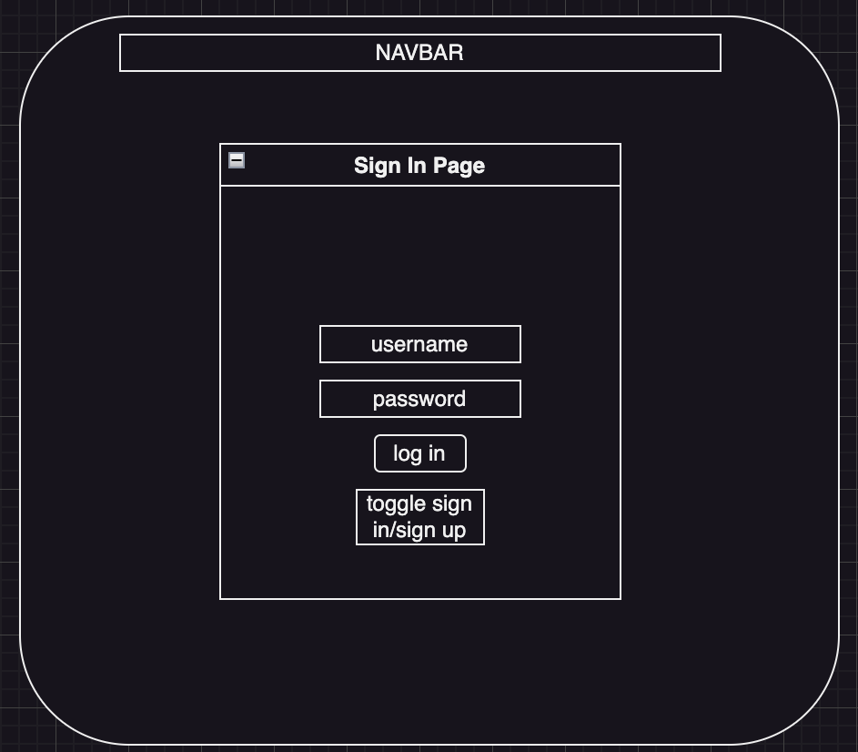

# Getting Started

Back-end Installation
Ensure you are in the root directory of the project.

Install pipenv and dependencies:

    pipenv install

Activate the virtual environment:

    pipenv shell

Database Setup
Navigate to the server directory:

    cd server

Create and seed your database:   

    flask db init   
    flask db migrate -m'initial migration'
    python seed.py

Open your terminal using your pipenv shell, navigate to server and run your backend:
    cd server
    python app.py

Open another terminal and using your pipenv shell, navigate to client and run your frontend:
    cd client
    npm run dev

# Meditation App (title pending)

A meditation platform that provides users a variety of filterable audio backgrounds and guided options for meditating, encourages users to practice regularly by recording their use history, and allows users to interact with the platform through journaling to record their thoughts and feedback about their sessions. 

## Core Features

* List of meditation audio options: A comprehensive database of audio background options that users can browse and choose from. 
* Filterable: Users can filter through audio options based on tag, category and duration, etc. 
* User Login: Secure login funcitonality for personalized user experience. 
* Calendar Feature: users can see and access their previous sessions stored in database. 
* Journal Feature: users can record their thoughts after each session, view, edit and delete them. 

## Advanced Features (Stretch Goals)

* Users will be encouraged to practice consistently by earning "streaks".
* Users will be able to schedule sessions in advance for themselves utilizing reminders.
* Users will be able to favorite audio files or combinations of audio background and duration for future sessions easy access. 
* Most played audio suggestions feature on home page for easy access.
* Track mood over time by recording mood each day
* Daily inspirational mantra on homepage

## Wireframe

## React Routes

## React Component Tree

## Database Schema

## API Routes

## Trello

https://trello.com/b/9Db4wvOf/meditationapp
